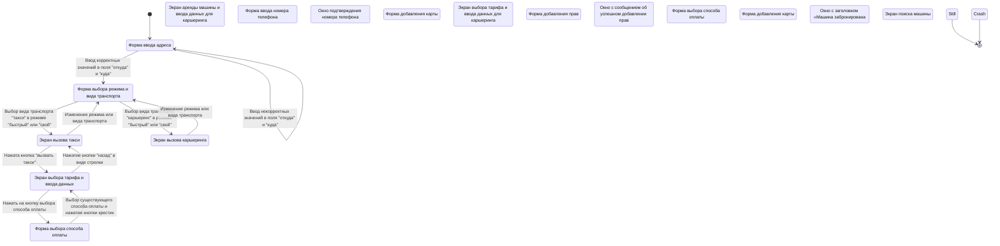

```mermaid
stateDiagram-v2
    [*] --> s1
		state "Форма ввода адреса" as s1
		state "Форма выбора режима и вида транспорта" as s2
		state "Экран вызова такси" as s3
		state "Экран вызова каршеринга" as s4
		state "Экран выбора тарифа и ввода данных" as s5
		state "Экран аренды машины и ввода данных для каршеринга" as s6
		state "Форма ввода номера телефона" as s7
		state "Окно подтверждения номера телефона" as s8
		state "Форма выбора способа оплаты" as s9
		state "Форма добавления карты" as s10
		state "Экран выбора тарифа и ввода данных для каршеринга" as s11
		state "Форма добавления прав" as s12
		state "Окно с сообщением об успешном добавлении прав" as s13
		state "Форма выбора способа оплаты" as s14
    state "Форма добавления карты" as s15
		state "Окно с заголовком «Машина забронирована" as s16
		state "Экран поиска машины" as s17
		
    Still --> [*]

		s1 --> s2: Ввод корректных значений в поля "откуда" и "куда"
		s1 --> s1: Ввод некорректных значений в поля "откуда" и "куда"
		s2 --> s3: Выбор вида транспорта "такси" в режиме "быстрый" или "свой"
		s3 --> s2: Изменение режима или вида транспорта
		s2 --> s4: Выбор вида транспорта "каршеринг" в режиме "быстрый" или "свой"
		s4 --> s2: Изменение режима или вида транспорта
		s3 --> s5: Нажата кнопка "вызвать такси"
		s5 --> s3: Нажатие кнопки "назад" в виде стрелки
		s5 --> s9: Нажать на кнопку выбора способа оплаты
		s9 --> s5: Выбор существующего способа оплаты и нажатие кнопки крестик
 
    Crash --> [*]
```
